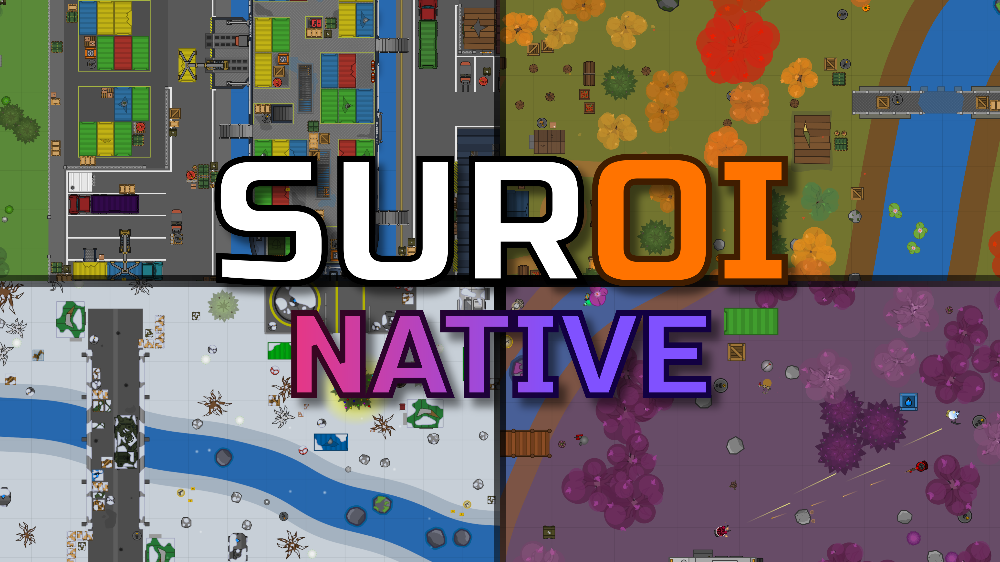

<div align="center">
    
</div>

<h1 align="center">Suroi's official native app, made entirely in Kotlin Multiplatform</h1>
<div align="center">
  
  
  
  
  
</div>

## Setup
First, start with installing either of the following IDEs


Next, install [Git](https://git-scm.com/) if it is not already installed, and use the following command to clone the repository:
```sh
git clone https://github.com/HasangerGames/suroi-app.git
```
Alternatively, you may use the git tools of the IDE to clone the repository.

Finally, import the gradle project in order to set up dependencies. The IDE should do this automatically.

## Run
Use the premade run configurations located in `/runConfigurations` to run the app on either Android or the current desktop operating system.
Be sure that you've installed the Android Virtual Device

For other running options, open Gradle tasks and choose any run option available.

## Project Information
* `/composeApp` is for code that will be shared across all the Compose multiplatform apps.
  It contains several subfolders:
  - `commonMain` is for code that’s common for all targets.
  - Other folders are for Kotlin code that will be compiled for only the platform indicated in the folder name.
    For example, if you want to use Apple’s CoreCrypto for the iOS part of your Kotlin app,
    `iosMain` would be the right folder for such calls.

* `/iosApp` contains iOS applications. Even if you’re sharing your UI with Compose Multiplatform, 
  you need this entry point for your iOS app. This is also where you should add SwiftUI code for your project.


Learn more about [Kotlin Multiplatform](https://www.jetbrains.com/help/kotlin-multiplatform-dev/get-started.html)…